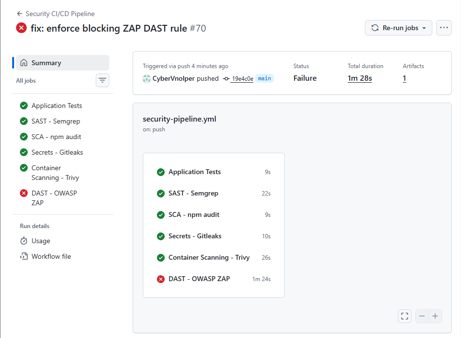
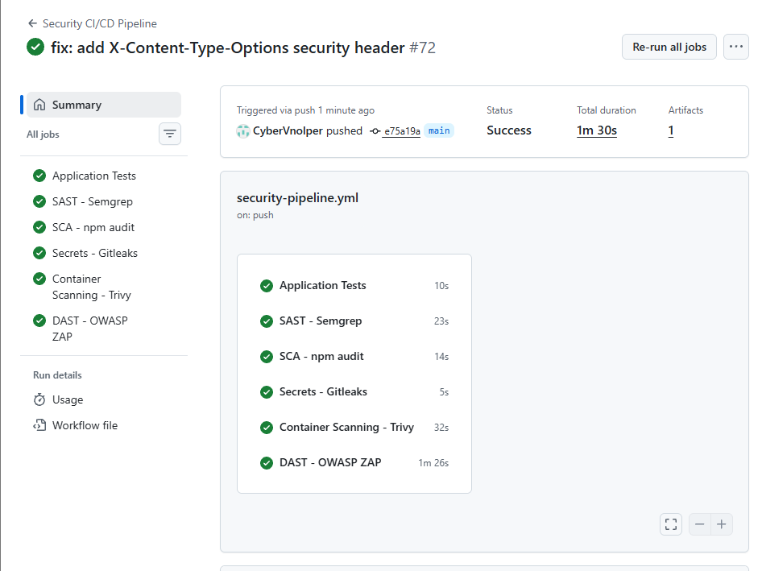

# DAST-001 — X-Content-Type-Options Header Missing

## 1. Identificación

- **ID:** DAST-001
- **Tipo:** DAST (Dynamic Application Security Testing)
- **Herramienta:** OWASP ZAP
- **Regla:** `10021`
- **Severidad:** Low
- **Estado:** Abierto
- **Fecha de detección:** 2026-10-05

## 2. Ubicación

- **Aplicación:** `secure-cicd-app`
- **Endpoint afectado:** `http://127.0.0.1:3000`
- **Método:** HTTP GET
- **Respuesta observada:** `200 OK`
- **Cabecera ausente:** `X-Content-Type-Options`

## 3. Descripción

OWASP ZAP ha detectado que la aplicación no devuelve la cabecera HTTP de seguridad `X-Content-Type-Options`.

Esta cabecera permite indicar al navegador que no debe realizar MIME sniffing del contenido recibido.

La ausencia de esta cabecera puede facilitar ciertos escenarios en los que el navegador interpreta un recurso con un tipo MIME diferente del esperado.

## 4. Resultado del análisis

El análisis DAST mediante OWASP ZAP produjo:

```text
FAIL-NEW: X-Content-Type-Options Header Missing [10021] x 1

FAIL-NEW: 1
FAIL-INPROG: 0
WARN-NEW: 0
WARN-INPROG: 0
INFO: 0
IGNORE: 5
PASS: 61
```

La política de seguridad del pipeline está configurada para que la regla `10021` tenga estado `FAIL`.

Como consecuencia, el pipeline queda bloqueado cuando ZAP detecta esta alerta.

## 5. Impacto

La ausencia de `X-Content-Type-Options` permite que los navegadores puedan intentar determinar el tipo de contenido mediante MIME sniffing.

Esto puede aumentar la superficie de ataque de la aplicación cuando se sirven recursos cuyo contenido podría interpretarse de forma incorrecta.

## 6. Causa

La aplicación no establece explícitamente la cabecera:

```text
X-Content-Type-Options: nosniff
```

en las respuestas HTTP.

## 7. Evidencia

La evidencia corresponde a la ejecución del análisis DAST en GitHub Actions.





El análisis muestra:

```text
FAIL-NEW: X-Content-Type-Options Header Missing [10021]
```

## 8. Acción correctiva

La aplicación deberá establecer la cabecera HTTP:

```text
X-Content-Type-Options: nosniff
```

en las respuestas.

Posteriormente se volverá a ejecutar el análisis DAST para verificar que la alerta `10021` desaparece.

## 9. Verificación posterior

Se añadió la cabecera de seguridad `X-Content-Type-Options: nosniff` a las respuestas HTTP de la aplicación.

La modificación se realizó en `app/src/server.js` mediante un middleware específico:

```javascript
app.use((req, res, next) => {
    res.setHeader("X-Content-Type-Options", "nosniff");
    next();
});
```

Tras aplicar la corrección se ejecutaron nuevamente los tests de la aplicación:

```text
Tests: 6
Passed: 6
Failed: 0
```

Posteriormente se ejecutó de nuevo el análisis DAST mediante OWASP ZAP en GitHub Actions.

Resultado del re-test:

```text
FAIL-NEW: 0
FAIL-INPROG: 0
WARN-NEW: 0
WARN-INPROG: 0
INFO: 0
IGNORE: 5
PASS: 62
```

La alerta:

```text
X-Content-Type-Options Header Missing [10021]
```

ya no aparece como `FAIL-NEW`.

El job **DAST - OWASP ZAP** finalizó correctamente y el pipeline volvió a quedar en estado verde.

### Evidencia del re-test





## 10. Estado

**Cerrado — cabecera de seguridad implementada y vulnerabilidad verificada mediante re-test.**
