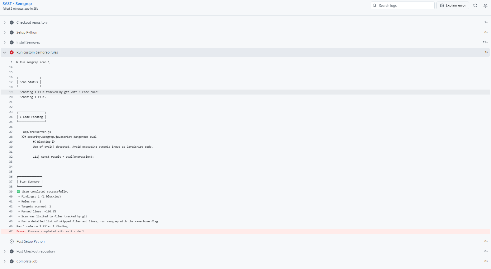

# SEM-001 — Uso de `eval()` detectado por Semgrep

## 1. Identificación

* **ID:** SEM-001
* **Tipo:** SAST (Static Application Security Testing)
* **Herramienta:** Semgrep
* **Regla:** `security.semgrep.javascript-dangerous-eval`
* **Severidad indicada por la herramienta:** Blocking
* **Estado:** Abierto
* **Fecha de detección:** 2026-09-30

## 2. Ubicación

* **Archivo:** `app/src/server.js`
* **Línea:** 111
* **Código detectado:**
  ```javascript
  const result = eval(expression);
  ```

## 3. Descripción

Semgrep ha detectado el uso de `eval()` en la aplicación.

`eval()` permite interpretar una cadena de texto como código JavaScript. Su utilización con contenido dinámico puede permitir la ejecución de código no autorizado si el valor procesado puede ser controlado o manipulado por una fuente externa.

El propio análisis de Semgrep identifica este uso como:

> Use of eval() detected. Avoid executing dynamic input as JavaScript code.

## 4. Resultado del análisis

El análisis SAST se ejecutó mediante el workflow de GitHub Actions.

Resultado obtenido:

```text
Scanning 1 file tracked by git with 1 Code rule

1 Code Finding

security.semgrep.javascript-dangerous-eval
Blocking

app/src/server.js
111┆ const result = eval(expression);

Scan Summary
Findings: 1 (1 blocking)
Rules run: 1
Targets scanned: 1
Scan completed successfully.

Process completed with exit code 1.
```

## 5. Impacto

El uso inseguro de `eval()` puede introducir un riesgo de ejecución de código si un atacante consigue influir en el contenido de `expression`.

El impacto concreto depende de cómo se construya y de dónde proceda el valor utilizado por la aplicación.

En este punto, el código vulnerable se mantiene sin modificar para conservar la evidencia original del hallazgo.

## 6. Causa

La causa del hallazgo es la utilización de `eval()` para ejecutar dinámicamente el contenido de la variable `expression`.

```javascript
const result = eval(expression);
```

## 7. Evidencia

La evidencia del hallazgo se obtiene directamente del resultado del workflow de GitHub Actions ejecutado con Semgrep.

Captura asociada:




## 8. Acción correctiva

La acción correctiva consistirá en eliminar el uso de `eval()` y sustituirlo por una implementación que no ejecute código JavaScript dinámico.

**La corrección todavía no se ha aplicado en esta fase del proyecto.**

## 9. Verificación posterior

Se corrigió el uso de `eval()` en `app/src/server.js` mediante una implementación controlada para operaciones aritméticas básicas, eliminando la ejecución dinámica de código JavaScript.

Antes de subir la corrección al repositorio se ejecutaron los tests de la aplicación:

```text
Tests: 6
Passed: 6
Failed: 0
```

Posteriormente se ejecutó de nuevo el workflow de GitHub Actions.

Resultado del análisis SAST con Semgrep:

```text
Scan completed successfully.
Findings: 0
Blocking findings: 0
Rules run: 1
Targets scanned: 1
Process completed with exit code 0.
```

La regla `security.semgrep.javascript-dangerous-eval` ya no genera ningún hallazgo.

### Evidencias del re-test


(../../evidence/screenshots/02-pipeline-clean.png)
(../../evidence/screenshots/03-semgrep-clean.png)


## 10. Estado

**Cerrado — vulnerabilidad corregida y verificada mediante re-test.**
