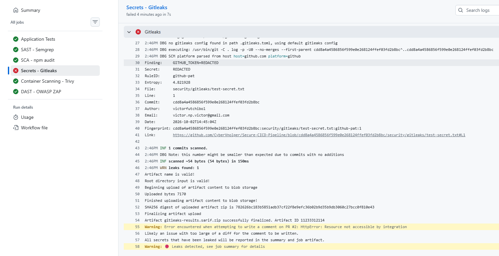
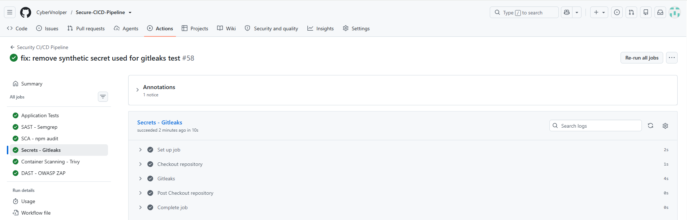

# SEC-001 — Secreto detectado por Gitleaks

## 1. Identificación

- **ID:** SEC-001
- **Tipo:** Secret Scanning
- **Herramienta:** Gitleaks
- **Severidad:** High
- **Estado:** Abierto
- **Fecha de detección:** 2026-10-02

## 2. Ubicación

- **Archivo:** `security/gitleaks/test-secret.txt`
- **Tipo de secreto:** Token sintético de laboratorio
- **Origen:** Introducido deliberadamente para validar el control de Secret Scanning.

## 3. Descripción

Gitleaks detectó un valor con formato compatible con un secreto dentro del repositorio.

El valor utilizado en esta prueba es sintético y no corresponde a ninguna credencial real.

La prueba se realizó para verificar que el pipeline es capaz de identificar secretos expuestos y bloquear la ejecución.

## 4. Resultado del análisis

Gitleaks detectó el secreto durante la ejecución del workflow de GitHub Actions.

Resultado:

```text
Secret detected
Pipeline blocked
Exit code: 1
```

## 5. Impacto

La exposición accidental de credenciales, tokens o claves en un repositorio puede permitir el acceso no autorizado a servicios o recursos asociados.

En este laboratorio no existe impacto sobre sistemas reales porque el valor utilizado es un secreto ficticio.

## 6. Causa

La causa del hallazgo fue la inclusión deliberada de un valor con formato de secreto dentro de:

```text
security/gitleaks/test-secret.txt
```

## 7. Evidencia

La evidencia corresponde al workflow de GitHub Actions en el que Gitleaks detectó el secreto.





## 8. Acción correctiva

Se eliminará del repositorio el archivo utilizado para la prueba:

```text
security/gitleaks/test-secret.txt
```

Posteriormente se volverá a ejecutar Gitleaks para comprobar que el repositorio queda limpio.

## 9. Verificación posterior

Pendiente de realizar.

Después de eliminar el secreto se ejecutará nuevamente el workflow de GitHub Actions.

Resultado esperado:

```text
✅ Gitleaks
✅ No leaks detected
✅ Exit code 0
```

La evidencia del re-test se añadirá como:




## 10. Estado

**Abierto — secreto de laboratorio pendiente de eliminación y re-test.**
